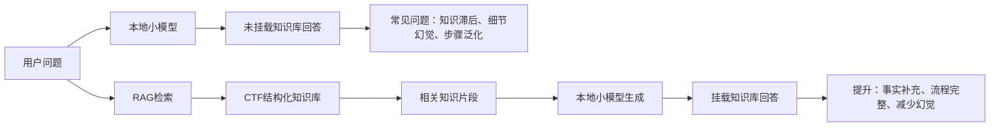

# 效果现象描述

## 实验目标

本实验不是证明大模型本身有多强，而是证明在断网、算力受限、只能使用本地小参数模型的环境中，RAG知识库可以针对性弥补小模型的弱点。实验对象可选用Qwen-2.5-7B，本地通过Docker部署OpenAI兼容接口，接入Cherry Studio知识库；嵌入模型可选用bge-m3，知识库文档采用Markdown格式。

## 小模型预期暴露的问题

1. 时间滞后性明显。面对2026年新披露漏洞、安全公告和最新补丁信息时，模型训练参数中没有相关知识，容易回答“不知道”、混入旧漏洞，或者编造看似合理的CVE细节。

2. 漏洞细节容易幻觉。小模型可能把不同厂商、不同产品、不同年份的漏洞混在一起，尤其在CVE编号、影响版本、利用条件、修复版本和是否存在公开PoC等字段上出现错误。

3. 复杂Web题容易套模板。未挂载知识库时，模型倾向于输出常见payload列表，但不根据过滤条件、回显方式、框架版本和部署环境调整思路。

4. Pwn题路线选择不稳定。模型可能忽略Canary、PIE、RELRO、seccomp、glibc版本等限制，给出与保护机制冲突的利用路线。

5. 逆向和密码综合题推理链较短。模型可能识别出算法名称，但无法完成常量提取、逆序还原、脚本验证和输出格式校验。

6. 取证题容易停留在工具枚举。模型能列出binwalk、strings、Wireshark、Volatility等工具，但不一定能根据线索组织优先级和证据链。

7. 遇到资料不足时不善于承认不确定。小模型常把推测写成结论，而不是标注“资料不足”“需要进一步验证”“该字段不能从题面确定”。

## RAG知识库预期提升点

1. 对新漏洞问题，知识库可补充模型训练后出现的事实信息，使模型能回答2026年漏洞编号、发布时间、产品名称、影响版本、利用条件和修复建议。

2. 对漏洞信息整理，模板化Markdown文档能让回答更稳定地覆盖“编号、时间、类别、影响版本、利用条件、PoC概要、检测方法、修复建议”等字段。

3. 对Web题，比赛WP和个人经验条目能帮助模型从“列payload”转向“按条件验证”，回答更贴近CTF实战。

4. 对Pwn题，知识库中的保护机制说明、glibc版本经验和典型利用链能帮助模型根据checksec结果选择更合理路线。

5. 对逆向、密码和取证题，知识库中的工具流程、脚本模板和排错经验能延长模型的推理链，减少“只说方向、不落步骤”的情况。

6. 对回答可信度，RAG可以促使模型引用检索到的条目，减少凭空编造；当知识库没有命中时，也更容易观察到模型是否会诚实说明不确定性。

## 对比实验记录方式

每道题分别在两种状态下提问：第一种是不挂载知识库，仅使用本地小模型；第二种是挂载CTF结构化知识库后使用同一模型、同一问题、同一温度和上下文设置。建议每个类别至少选择8到12道题，记录多次问答后的平均表现。

## 建议评分指标

| 指标 | 说明 |
| --- | --- |
| 事实准确性 | 是否正确回答漏洞编号、产品、版本、工具、算法和前提条件 |
| 条件判断能力 | 是否能根据题目限制调整解题路线，而不是套固定模板 |
| 解题完整性 | 是否覆盖信息收集、判断、利用、验证和排错过程 |
| 场景贴合度 | 是否符合CTF、本地靶场、断网比赛和小模型使用环境 |
| 幻觉控制能力 | 是否减少编造CVE、PoC、版本、命令和不存在工具的情况 |
| 知识库利用能力 | 是否能够引用、融合或遵循知识库中的结构化条目 |

## 预期结果表述

| 实验类别 | 未挂载知识库的典型表现 | 挂载知识库后的典型表现 | 可证明的问题或提升 |
| --- | --- | --- | --- |
| 2026新漏洞 | 不知道或编造新漏洞细节 | 能基于知识库回答新漏洞字段 | 证明训练时间滞后可由RAG缓解 |
| Web复杂场景 | 泛泛列payload，忽略过滤条件 | 能按环境和限制制定验证流程 | 证明知识库提升实战可操作性 |
| Pwn复杂保护 | 利用路线与保护机制冲突 | 能结合保护机制选择路线 | 证明知识库提升条件判断能力 |
| 逆向与密码 | 只识别算法，缺少还原链路 | 能给出提取、还原、验证流程 | 证明知识库增强长链路推理 |
| 取证与Misc | 枚举工具但缺少证据链 | 能按线索优先级排查 | 证明知识库提升流程化分析 |
| 知识库构建 | 无法稳定说明模板和分块 | 能按类别生成结构化知识条目 | 证明通用构建方法有实用价值 |

## 可放入论文的实验现象描述

在未挂载知识库时，本地小参数模型对基础概念类问题仍具有一定回答能力，但面对训练时间之后出现的新漏洞、版本依赖明显的漏洞信息、带有多重过滤条件的Web题、受保护机制影响的Pwn题以及多线索取证题时，回答质量下降明显。主要表现为事实字段错误、利用条件遗漏、回答结构松散、步骤不可复现，以及将不确定内容表述为确定结论。

挂载RAG知识库后，模型回答在结构化程度和场景贴合度上明显提升。对于新漏洞问题，模型能够从知识库中检索到训练数据之外的更新信息；对于CTF题型问题，模型更倾向于按照知识库中的经验模板组织回答，例如先判断环境和限制，再选择验证方法，最后给出排错方向。实验结果可说明，本文构建的知识库并不是简单资料堆积，而是通过模板化、分类化和可持续扩展的方式，将个人经验、比赛WP、理论题库和漏洞信息转化为小模型可检索、可复用的外部知识。

## 论文中建议呈现方式

论文实验章节不需要逐条展开每次问答内容。可以每类选择1个典型样例展示“未挂载知识库回答片段”和“挂载知识库回答片段”的差异，再用总表统计各类别多次实验的平均评分。这样既能体现实验覆盖面，又能避免论文主体被大量问答记录占据。

## 预期统计表模板

最终论文中可将下表替换为实际评分数据。

| 类别 | 问题数量 | 未挂载知识库平均分 | 挂载知识库平均分 | 主要提升 |
| --- | ---: | ---: | ---: | --- |
| 2026新漏洞 | 12 | 低 | 高 | 时间滞后缓解、幻觉减少 |
| Web复杂场景 | 12 | 中低 | 高 | 条件判断和payload组织增强 |
| Pwn复杂保护 | 12 | 中低 | 中高 | 保护机制识别和路线选择增强 |
| 逆向与密码 | 12 | 中 | 中高 | 长链路推理和脚本验证增强 |
| 取证与Misc | 12 | 中 | 高 | 工具链组织和证据链增强 |
| 知识库构建 | 12 | 中低 | 高 | 模板化构建和可扩展性体现 |

## 可选图示

## 适合支撑论文贡献点的结论

通过该组实验，可以支撑论文中的三个核心贡献点：第一，面向CTF领域设计通用Markdown知识库构建方法，使个人经验、比赛WP、理论题库和漏洞信息能够快速转换为可检索知识；第二，在受限环境下验证RAG对本地小参数模型的能力增强作用；第三，通过GitHub开源仓库组织知识库和模板，支持后续社区持续扩展。
